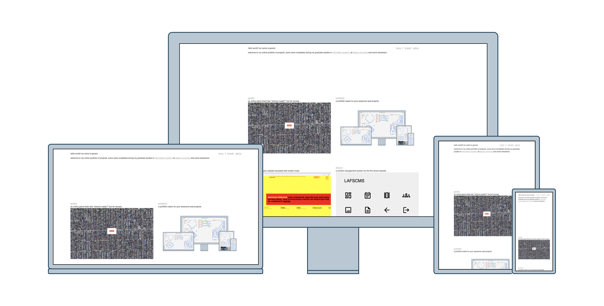
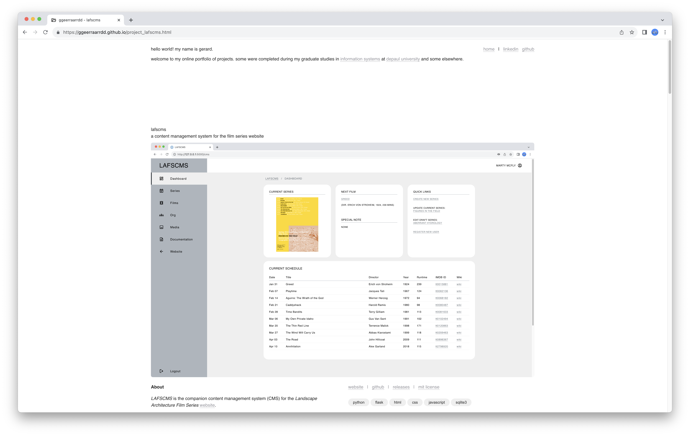

# GGEERRAARRDD

An online portfolio of projects

## Table of Contents

> [!NOTE]
> ALL CONTENTS IN THIS REPO ARE FOR EDUCATIONAL PURPOSES ONLY.

* [Description](#description)
* [Target Users](#target-users)
* [Features](#features)
* [Project Structure](#project-structure)
* [Quick Start](#quick-start)
* [Local Setup](#local-setup)
  * [Prerequisites](#prerequisites)
  * [Dependencies](#dependencies)
  * [Installation](#installation)
  * [Configuration](#configuration)
* [Usage](#usage)
* [Production Setup](#production-setup)
* [System Administration](#system-administration)
* [Author(s)](#authors)
* [Version History](#version-history)
  * [Release Notes](#release-notes)
  * [Initial Release](#initial-release)
* [Future Work](#future-work)
* [License](#license)
* [Contributing](#contributing)
* [Acknowledgments](#acknowledgments)
* [Screenshots](#screenshots)

## Description

Select projects completed during my graduate studies in [Computer Science](https://www.cdm.depaul.edu/academics/Pages/MS-in-Computer-Science.aspx) at [DePaul University](https://www.depaul.edu/Pages/default.aspx).

*Image created using [Portfoliofy](https://github.com/ggeerraarrdd/portfoliofy).*

## Target Users

* TBD

## Features

* TBD

## Project Structure

* TBD

## Quick Start

* TBD

## Local Setup

### Prerequisites

* NA

### Dependencies

* NA

### Installation

* NA

### Configuration

* NA

## Usage

* Access the website via <https://ggeerraarrdd.github.io/>

## Production Setup

* TBD

## System Administration

* TBD

## Author(s)

* [@ggeerraarrdd](https://github.com/ggeerraarrdd/)

## Version History

### Release Notes

* See <https://github.com/ggeerraarrdd/ggeerraarrdd.github.io/releases>

### Initial Release

* NA

## Future Work

* Other projects on the way.

## License

* [MIT License](https://github.com/ggeerraarrdd/large-parks/blob/main/LICENSE)

## Contributing

* NA

## Acknowledgments

* TBD

## Screenshots

## Frontispiece

TBD
